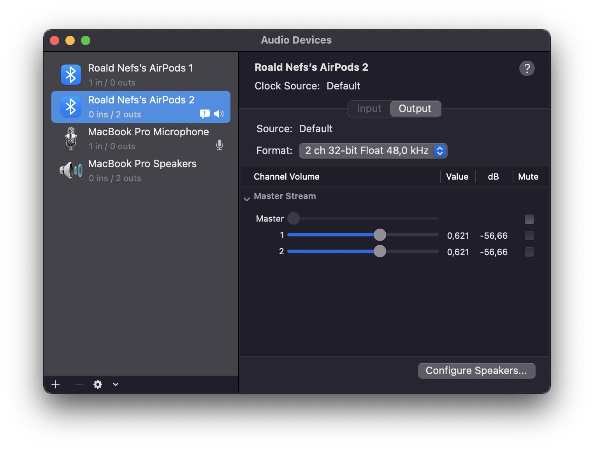
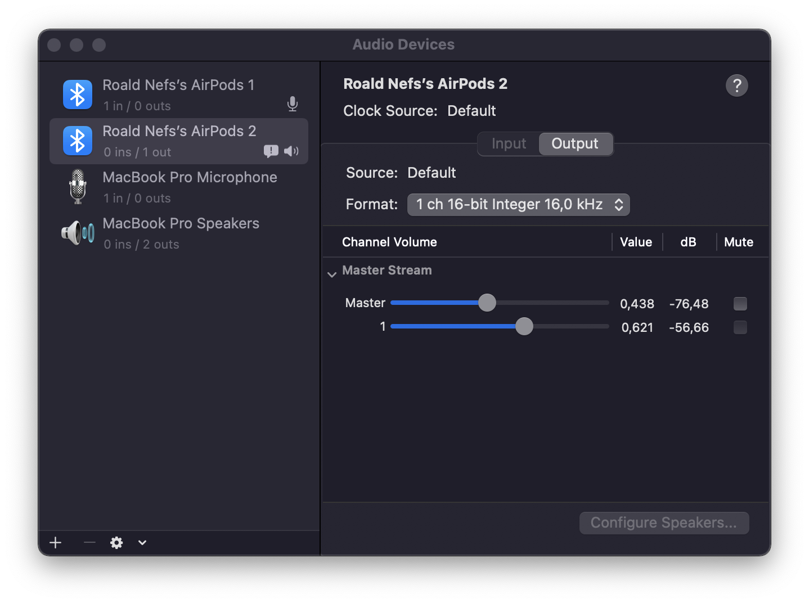

<a href="https://github.com/roaldnefs/airpods" style="color: black;">
    <h1 align="center">AirPods fix for macOS</h1>
</a>

    
    
    
     
    AirPods sound quality fixer and battery life enhancer for <b>macOS</b>.
     
    <a href="#usage"><strong>Usage »</strong></a>
     
    <a href="#explanation">Explanation</a>
    ·
    <a href="https://github.com/roaldnefs/airpods/issues/new">Report Bug</a>
    ·
    <a href="https://github.com/roaldnefs/airpods/issues/new">Request Feature</a>

## Contents
- [Contents](#contents)
- [Usage](#usage)
  - [Setup keyboard shortcut using Automator](#setup-keyboard-shortcut-using-automator)
- [Explanation](#explanation)
- [References](#references)
## Usage
### Setup keyboard shortcut using Automator

**Description:** Setup a keyboard shortcut to change the sound input device to the built-in microphone using [Automator](https://support.apple.com/en-gb/guide/automator/welcome/mac).

<b>Show instructions</b>

 

1. Open [Automator](https://support.apple.com/en-gb/guide/automator/welcome/mac).
1. Make a **Quick Action**.
1. Make sure it receives **no input** at all programs.
1. Select **Run Apple Script** and paste the contents from `airpods.applescript`.
1. Save the **Quick Action**.
1. Open **System Preferences** > **Keyboard** > **Shortcuts** and select **Services** from the sidebar and find your under the **General** section.
1. Add a shortcut by double clicking `(none)`.

## Explanation
When the microphone on the AirPods is enabled, the Bluetooth protocol and the compression protocol is changed from A2DP to HSP, downgrading the audio format from 48 kHz to 16 kHz.

Using  [Audio MIDI Setup](https://support.apple.com/en-gb/guide/audio-midi-setup/welcome/mac) you can this yourself. When the MacBook Pro Microphone is selected as the input device, the AirPods will output at 48,0 kHz:

When the AirPods itself are selected as the input device, they will only output at 16,0 kHz:

## References
For references and further information about the Airpods issue see:
- Apple Community: [AirPods stuck on 16kHz/ SCO codec](https://discussions.apple.com/thread/251360777?answerId=252681287022#252681287022)
- Jeff Geerling’s blog post: [AirPods get stuck in low-quality 16 kHz audio mode when starting a VM](https://www.jeffgeerling.com/blog/2018/airpods-get-stuck-low-quality-16-khz-audio-mode-when-starting-vm)
- Reddit r/airpods: [AirPods low quality issue](https://www.reddit.com/r/airpods/comments/6jqqu4/airpods_low_quality_issue/)

For a collection of AppleScript snippets, applets, resources and links, see: [roaldnefs/applescript](https://github.com/roaldnefs/applescript).
